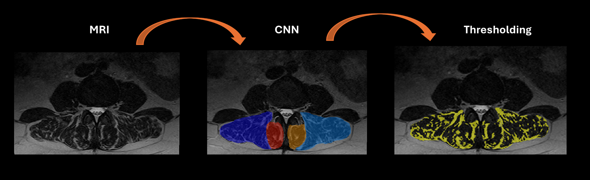

<h1 align="center"> <strong> Eddo's PhD repository</h1>

<p align="center">
  <a href="https://scholar.google.com/citations?user=0aYqoMMAAAAJ&hl=en">
    
  </a>
  <a href="https://www.linkedin.com/in/eddo-wesselink-1a106089/?originalSubdomain=nl">
    
  </a>
  <a href="https://orcid.org/0000-0002-2024-6986">
    
  </a>
  <a href="https://twitter.com/EddoWesselink">
    
  </a>
</p>

<p align="center">
    
</p>

## <strong> Content 

In this repository I will share my PhD codes for supervised and non-supervised machine learning models for the quantification of lumbar paraspinal muscle health using conventional T<sub>2</sub>-weighted MRI. The repository will contain programming codes (Python) for:

- Convolutional Neural Networks for the automatic segmentation of the lumbar paraspinal muscles
  
  Link to paper: https://www.nature.com/articles/s41598-022-16710-5

- Quantifying lumbar paraspinal intramuscular fat from clinical MRI 

  Link to paper: https://www.ncbi.nlm.nih.gov/pmc/articles/PMC10869289/


### Prerequisites

Make sure you have the following dependencies installed:

- Python 3.x
- NumPy
- Pandas
- SciPy
- scikit-learn
- nibabel

You can install all the dependencies by running:

```bash
pip install -r requirements.txt

This will install all the required packages listed in the `requirements.txt` file. Make sure you have `pip` installed and configured on your system.

### Usage

To use the code, follow these steps:

1. Clone this repository to your local machine:

```bash
git clone https://github.com/Eddowesselink/PhD.git


